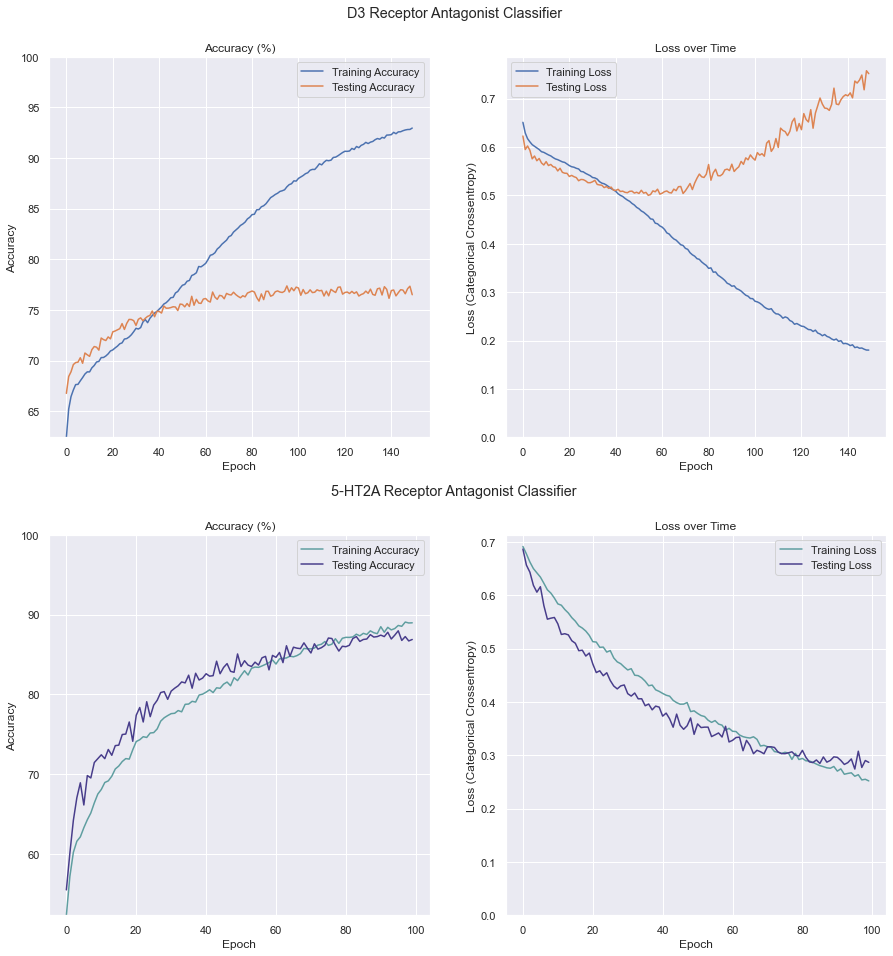
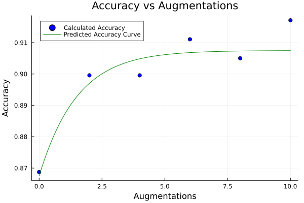
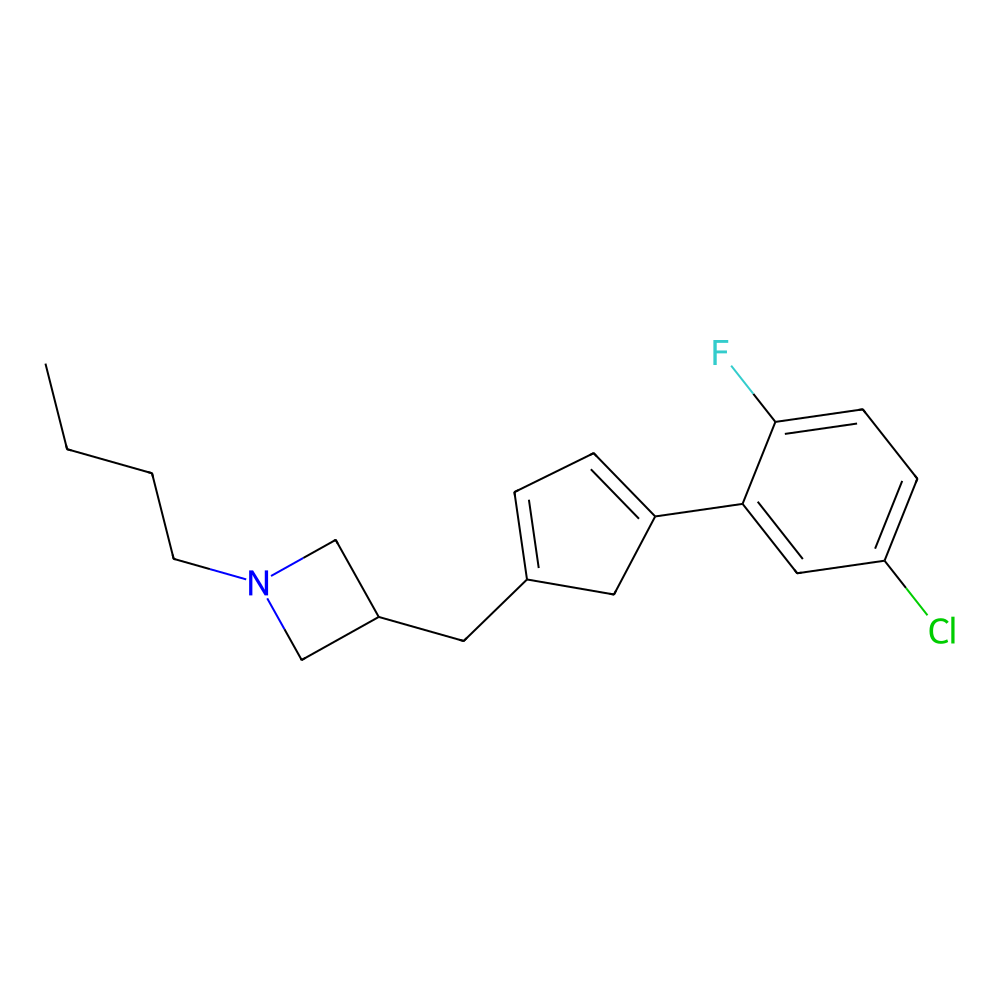
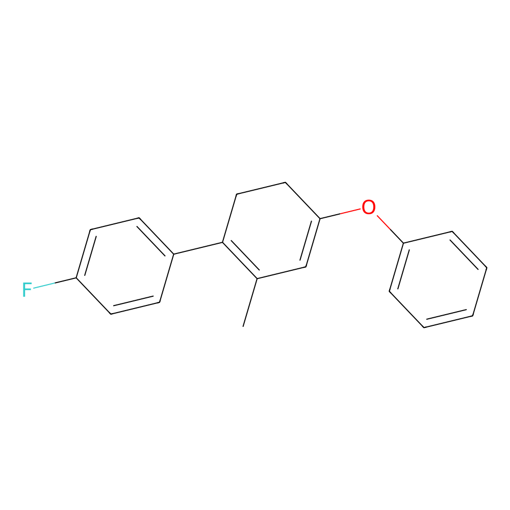
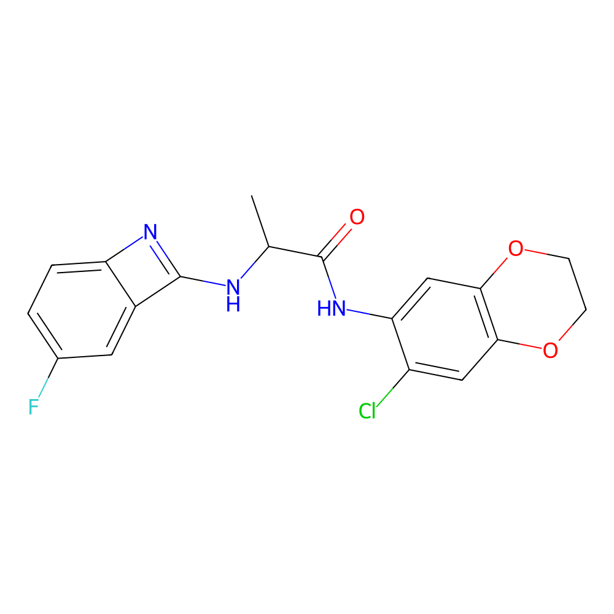
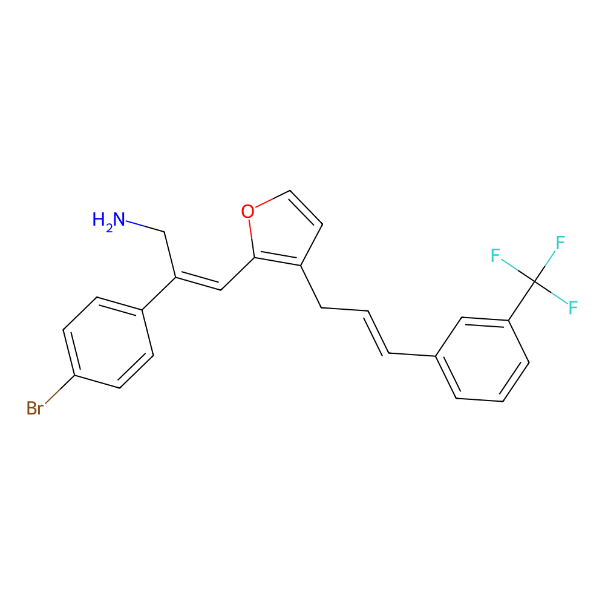
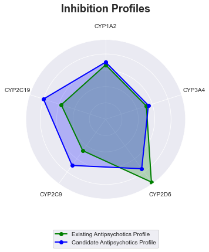

# Results

## Drug Design

Antipsychotics are generally dopaminergic and serotonergic.
Research suggests that the mechanism of action for antipsychotics involves the antagonism of D2 receptors since the decrease in activity is associated with less positive psychotic symptoms [[1]](#references).
Research also suggests that antipsychotics interact with serotonin receptors by antagonizing 5-HT2A receptors which is thought to help with the mood related symptoms associated with psychotic disorders [[2, 3]](#references).
Current anitpsychotics apppear to have certain problems in the form of various side-effects ranging from cognitive impairments to tardive dyskinesia [[4, 5]](#references).
Literature has investigated other potential mechanisms of action for antipsychotics including the antagonism of D3 receptors [[6, 7]](#references).
The antagonism of D3 receptors could potentially improve cognitive impairments associated with antipsychotic use as well as decrease extrapyramidal symptoms since D3 receptors are localized to a specific regions of the brain [[8]](#references).
Due to these properties, the antagonism of 5-HT2A receptors and of D3 receptors were chosen as drug targets for the discovery of potential antipsychotics.

## Model Performance

Two RNNs were trained.
One was used to identify 5-HT2A antagonism while the other was trained to classify D3 antagonism.
The datasets used were gathered from this PubChem [bioassay](https://pubchem.ncbi.nlm.nih.gov/bioassay/652054) at and from CHEMBL at target [CHEMBL224](https://www.ebi.ac.uk/chembl/target_report_card/CHEMBL224/).
The size the datasets after augmentation using the enumeration of SMILES strings were 109404 total strings for the dopamine receptor dataset and 16528 strings for the serotonin receptor dataset.
The results of both training sessions are shown below.



In some cases, accuracy could be improved using techniques post-training due to the nature of the dataset.
Since each molecule has multiple corresponding SMILES strings, if one were to have each neural network predict on multiple SMILES strings that represented the same molecule and average the answers of those predictions the neural network would have a more accurate prediction overall.
The accuracy of this method does have a leveling off point since the prediction accuracy versus amount of augmentations appears to follow a logistic curve which is outlined in `predictor/optimize_n.sh`. However in some instances, this is not possible. An example curve for the classification of 5-HT2A antagonism is shown below.



## Inverse QSAR

Alongisde the drug targets, certain structural requirements were also optimized for. These included fulfilling all criteria of Lipinski's Rule of 5, not flagging a PAINS filter, maintaining a synthetic accessibility below 3, and not having rings of carbon larger than 6 carbons. The fitness function assigned a very low score to any molecules that included tokens outside of the RNN's vocabulary and any molecules that laid outside of a specific molecular weight requirement. After training the genetic algorithm for 20 generations with a population of 100, all molecules produced fulfilled at least one of the drug targets with the majority of those molecules fulfilling both. Some example molecules are shown below.






## Drug Candidate Analysis

A selection of antipsychotics were selected from this [PubMed Article](https://www.ncbi.nlm.nih.gov/books/NBK107237/table/introduction.t1/) to compare against a selection of 20 drug candidates generated by the inverse QSAR. The selection of top drug candidates was determined by using the [IBM RXN API](https://rxn.res.ibm.com/). The top candidates were ones that had a combination of the highest fitness according to the genetic algorithm, how confident the API was that the given chemical had a retrosynthetic route, how many of those routes were present, and what portion of reactants needed for that route were commercially available. The selection of drug candidates is shown below.

```txt
NC(=O)C(Nc1cccc(Oc2ccccc2)c1)c1ccc(F)c(Cl)c1
COc1ccc(C(=O)Nc2cccc(Cl)c2C)c(-c2cccc(Cl)c2)n1
COCC1CCCN(Cc2nn(-c3ccccc3Cl)cc2C)C1
NC(=O)C(Nc1cccc(Oc2ccccc2)c1)c1cccc2c1CCCC2
CN(CC1C=C(Oc2ccccc2)C1)c1ccc(F)cc1
CC(NC1=Nc2ccc(F)cc21)C(=O)Nc1cc2c(cc1Cl)OCCO2
Cc1ccc(C(F)(F)F)cc1C=CC(=O)Nc1ncc(F)c(-c2cccc(Cl)c2)n1
CCOc1ccc(F)c(C(=O)Cl)c1
O=C(CCCC1=CCNc2ccccc21)Nc1cc(F)ccc1OCOCCO
CC1=CC(C(=O)COC(=O)c2cc(Cl)c3c(c2)OCCCO3)=C1C
CCN1CCCN(Cc2nn(-c3ccccc3Cl)cc2C)C1
CCCCC1CCCN(Cc2nn(-c3ccccc3Cl)cc2C)C1
CCC1CCCN(Cc2nn(-c3ccccc3Cl)cc2C)C1
CC(=C1SC(=O)N(c2ccc(Cl)cc2)C1=O)c1ccc(Br)cc1
CC(NC(=O)COc1cccc(Oc2ccccc2)c1)c1ccc(F)cc1
Cc1ccc2c(c1)N(C(=O)CC(O)c1ccc(Cl)cc1)CC2
CCOc1cccc(NC(C(N)=O)c2ccc(F)cc2)c1
O=C(Cc1csc(NC(=O)Nc2ccc(Cl)cc2)[n+]1[O-])Nc1cc2c(cc1Cl)OCCO2
Cc1occc1C(=O)C(C#N)=Cc1cccc(C(F)(F)F)c1
CC(C)(C)Cc1occc1CC=Cc1cccc(C(F)(F)F)c1
```

The top candidates were compared to the existing antipsychotics in terms of pharmokinetics using [SwissADME](http://www.swissadme.ch/index.php) [[10]](#references). In terms of CYP enzyme inhibition, the candidates and actual antipsychotics were quite similar and according to an ANOVA test they did not differ significantly (p < 0.05) which is shown in the figure below.



The candidates only significantly differed in categories in the table below. All other categories calculated by SwissADME did not significantly differ in any other categories. A complete evaluation of the pharmokinetics can be found [here](./results).

| Category                 | Average for Existing Antipsychotics | Average for Drug Candidates |
|--------------------------|-------------------------------------|-----------------------------|
| MW                       | 391.743810 | 349.7450 |
| Number of Aromatic heavy atoms     |  12.952381 | 12.8500 |
| Fraction Csp3            |   0.393810 | 0.2550 |
| Number of Hydrogen bond donors |   0.523810 | 0.9000 |
| XLOGP3                   |   4.079048 | 4.1570 |
| MLOGP                    |   3.576190 | 3.3445 |
| Silicos IT Log P          |   4.192381 | 4.2615 |
| Pgp substrate            |   0.761905 | 0.2500 |
| Synthetic_Accessibility  |   3.625714 | 3.1070 |

## References

1. Price, R., Salavati, B., Graff-Guerrero, A., Blumberger, D. M., Mulsant, B. H., Daskalakis, Z. J., &amp; Rajji, T. K. (2014, October 3). Effects of antipsychotic D2 antagonists on long-term potentiation in animals and implications for human studies. Progress in neuro-psychopharmacology &amp; biological psychiatry. Retrieved April 22, 2023, from [https://www.ncbi.nlm.nih.gov/pmc/articles/PMC4138225/]
2. Tsartsalis, S., Tournier, B. B., Gloria, Y., Millet, P., &amp; Ginovart, N. (2021, January 14). Effect of 5-HT2A receptor antagonism on levels of D2/3 receptor occupancy and adverse behavioral side-effects induced by haloperidol: A SPECT imaging study in the rat. Nature News. Retrieved April 22, 2023, from [https://www.nature.com/articles/s41398-020-01179-5]
3. S;, P. E. M. J. A. M. J. J. M. (n.d.). Neurobiological bases of Quetiapine antidepresant effect in the bipolar disorder. Actas espanolas de psiquiatria. Retrieved April 22, 2023, from [https://pubmed.ncbi.nlm.nih.gov/20931407/#:~:text=Quetiapine%20also%20enhances%20the%20serotoninergic,HT2A%20receptors%20and%20a2%20adrenoceptors]
4. MacKenzie, N. E., Kowalchuk, C., Agarwal, S. M., Costa-Dookhan, K. A., Caravaggio, F., Gerretsen, P., Chintoh, A., Remington, G. J., Taylor, V. H., Müeller, D. J., Graff-Guerrero, A., &amp; Hahn, M. K. (2018, December 5). Antipsychotics, metabolic adverse effects, and cognitive function in schizophrenia. Frontiers in psychiatry. Retrieved April 22, 2023, from [https://www.ncbi.nlm.nih.gov/pmc/articles/PMC6290646/]
5. Loughlin, A. M., Lin, N., Abler, V., &amp; Carroll, B. (2019, June 4). Tardive dyskinesia among patients using antipsychotic medications in customary clinical care in the United States. PloS one. Retrieved April 22, 2023, from [https://www.ncbi.nlm.nih.gov/pmc/articles/PMC6548364/]
6. Meltzer, H. Y. (n.d.). The role of serotonin in antipsychotic drug action. Nature News. Retrieved April 22, 2023, from [https://www.nature.com/articles/1395370]
7. Macdonald, G. J., &amp; Bartolomé , J. M. (2010, September 18). A decade of progress in the discovery and development of 'atypical' antipsychotics. Progress in Medicinal Chemistry. Retrieved April 22, 2023, from [https://www.sciencedirect.com/science/article/abs/pii/S0079646810490025]
8. Maramai, S., Gemma, S., Brogi, S., Campiani, G., Butini, S., Stark, H., &amp; Brindisi, M. (2016, September 20). Dopamine D3 receptor antagonists as potential therapeutics for the treatment of neurological diseases. Frontiers. Retrieved April 22, 2023, from [https://www.frontiersin.org/articles/10.3389/fnins.2016.00451/full]
9. BW;, M. H. Y. M. (n.d.). The role of serotonin receptors in the action of atypical antipsychotic drugs. Current opinion in pharmacology. Retrieved April 22, 2023, from [https://pubmed.ncbi.nlm.nih.gov/21420906/]
10. Daina, A., Michielin, O., &amp; Zoete, V. (2017, March 3). SwissADME: A free web tool to evaluate pharmacokinetics, drug-likeness and medicinal chemistry friendliness of small molecules. Nature News. Retrieved April 30, 2023, from [https://www.nature.com/articles/srep42717]
